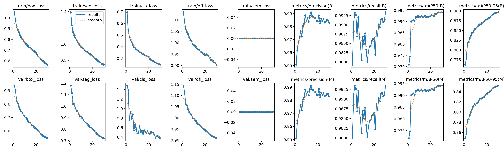
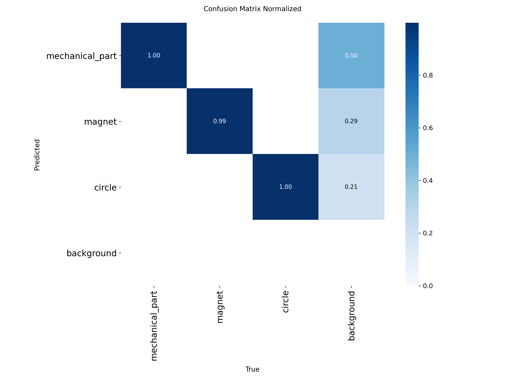
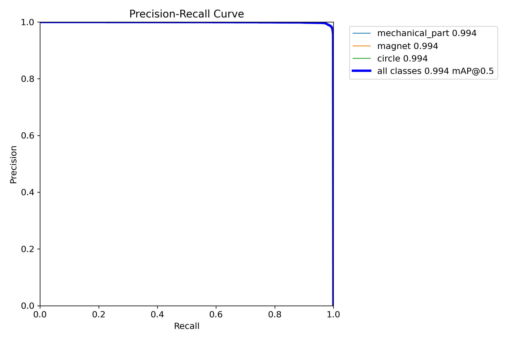
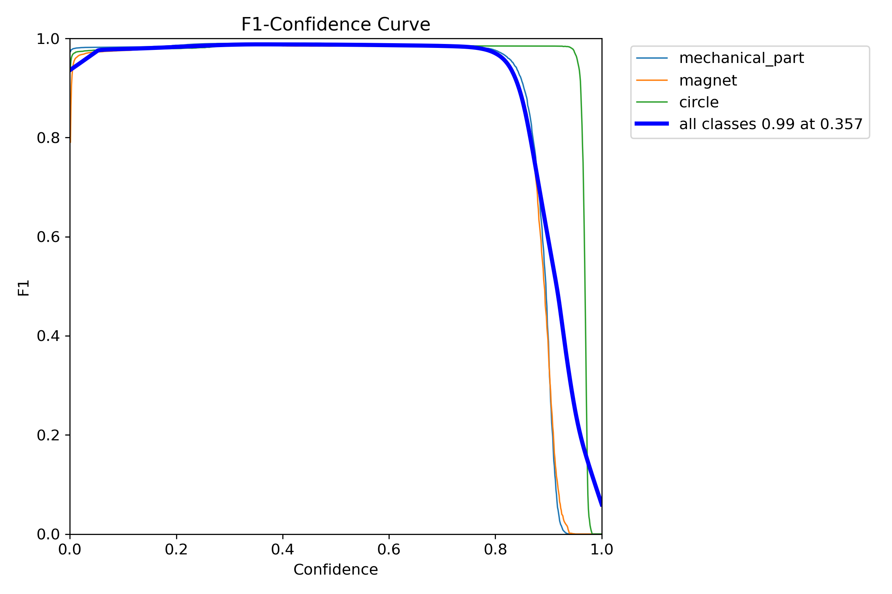
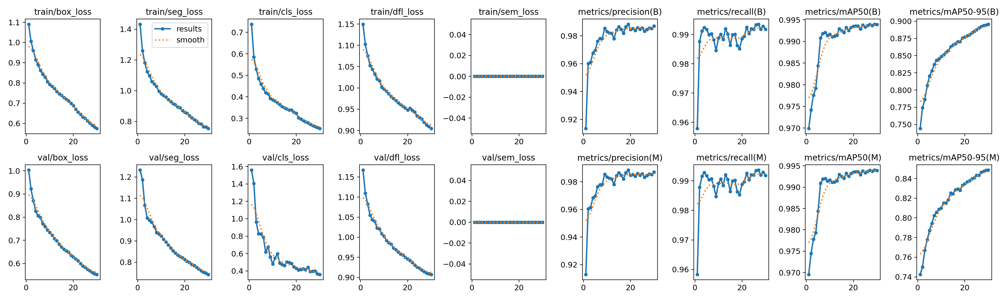
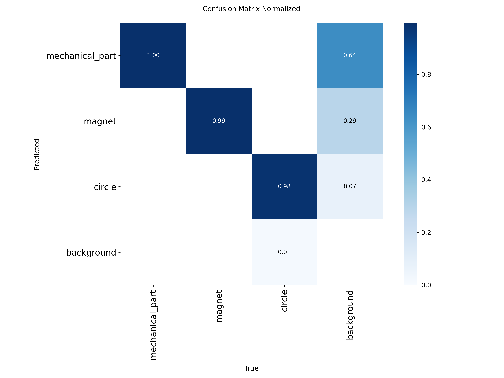
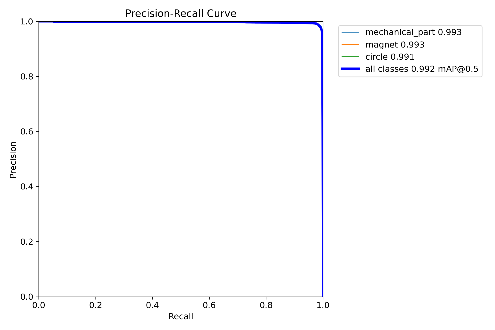
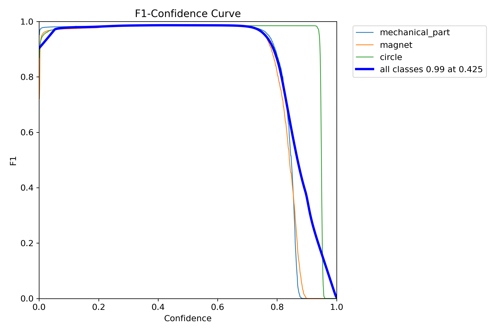
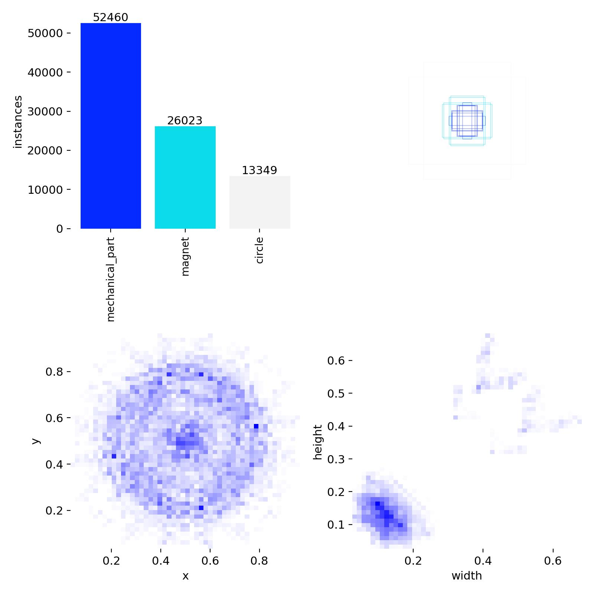

# Models Training Results & Benchmark

**Date**: 2026-03-21  
**Hardware**: 2× NVIDIA Tesla T4 (16 GB VRAM each, 32 GB total) — Kaggle  
**Parallelism**: `nn.DataParallel` (PyTorch) / `device=[0,1]` (Ultralytics)  
**Training**: 30 epochs, AdamW with Cosine Annealing LR, batch size 16 (8 per GPU), 512×512  
**Labels**: `michanical_part`, `magnet`, `circle` (multi-class segmentation, 4 classes incl. background)

> **Dataset Note**:  
> - **All models** were trained on **augmented data** (3,460 images — 10× augmentation: 2 geometric × 5 photometric, no rotation).  
> - Both T4 GPUs were used in parallel via `nn.DataParallel` (UNet ResNet18) and `device=[0,1]` (YOLO models).

---

## 1. Models Trained

| Model | Architecture | Type | Framework | Training Data |
|-------|-------------|------|-----------|---------------|
| UNet ResNet18 | Encoder–Decoder with ResNet18 backbone | Multi-class segmentation | PyTorch (DataParallel) | Augmented (3,460 images) |
| YOLOv8m-seg | CSPDarknet + C2f, Medium | Instance segmentation | Ultralytics (multi-GPU) | Augmented (3,460 images) |
| YOLOv11m-seg | Improved CSP + C3k2, Medium | Instance segmentation | Ultralytics (multi-GPU) | Augmented (3,460 images) |

---

## 2. Best Validation Results

| Model | Best IoU | Best Val Loss | Best Epoch | Accuracy | Dice |
|-------|----------|--------------|------------|----------|------|
| **UNet ResNet18** | **0.9646** | **0.0155** | 30 | 99.56% | 0.9819 |
| YOLOv8m-seg | 0.8719 | 0.7211 | 30 | — | — |
| YOLOv11m-seg | 0.8725 | 0.7196 | 30 | — | — |

> **Winner by IoU**: UNet ResNet18 (0.9646) — achieves the highest segmentation quality with the lowest GPU memory usage.

### YOLO-Specific Metrics (Epoch 30)

| Model | mAP50 (Box) | mAP50-95 (Box) | mAP50 (Mask) | mAP50-95 (Mask) | Precision (M) | Recall (M) |
|-------|-------------|----------------|--------------|-----------------|---------------|------------|
| YOLOv8m-seg | 0.9916 | 0.9114 | 0.9916 | 0.8719 | 0.9927 | 0.9981 |
| YOLOv11m-seg | 0.9929 | 0.9111 | 0.9929 | 0.8725 | 0.9926 | 0.9982 |

---

## 3. Training Efficiency

| Model | Total Train Time | Time / Epoch | Peak GPU (MB) | Avg GPU Util. |
|-------|-----------------|--------------|---------------|---------------|
| **UNet ResNet18** | **115 min** | ~230 s | **473** | 54.8% |
| YOLOv8m-seg | 110 min | ~217 s | 4,296 | — |
| YOLOv11m-seg | 118 min | ~233 s | 4,902 | — |

> **Fastest model**: YOLOv8m-seg (110 min for 30 epochs).  
> **Most memory-efficient**: UNet ResNet18 — uses only 473 MB VRAM, ~9× less than YOLO models.  
> **Total training time**: ~5.7 hours for all 3 models on Kaggle T4×2.

---

## 4. Convergence Analysis

### UNet ResNet18 (Augmented Data — 3,460 images)
- Excellent convergence: IoU climbs from 0.8455 (epoch 1) to **0.9646** (epoch 30).
- Best validation Dice (0.9819) and accuracy (99.56%) among all models.
- Very low validation loss (0.0155) — strong generalization with minimal overfitting.
- Peak GPU usage only 473 MB thanks to the lightweight encoder.

### YOLOv8m-seg (Augmented Data — 3,460 images)
- mAP50 (Mask) reached 0.9557 in epoch 1, plateauing near 0.9916 by epoch 30.
- mAP50-95 (Mask) improved steadily to 0.8719.
- Very high precision/recall on detection (>0.99).
- Peak GPU memory: 4,296 MB.

### YOLOv11m-seg (Augmented Data — 3,460 images)
- Similar trajectory to YOLOv8m with slightly better final mask mAP (0.8725 vs 0.8719).
- Slightly slower training time (118 min vs 110 min).
- Highest peak GPU usage at 4,902 MB.

---

## 5. Comparison Plots

All plots include all 3 models and are stored in `outputs/results/plots/`.

### 5.1 Comprehensive Comparison

*6-panel dashboard comparing all models: validation loss, IoU, training loss, best IoU, GPU memory, and training time.*

### 5.2 IoU Curves

*Validation IoU / mAP50-95 progression over 30 epochs. UNet converges to 0.96+; YOLO models plateau near 0.87.*

### 5.3 Loss Curves

*Training and validation loss over 30 epochs. Note: YOLO loss (seg+box) is not directly comparable to PyTorch BCE+Dice loss.*

### 5.4 GPU Usage

*Peak GPU memory comparison. UNet ResNet18 uses 10× less VRAM than YOLO models.*

### 5.5 Training Time

*Total training time per model (30 epochs). All models completed in under 2 hours on Kaggle T4×2.*

### 5.6 Comparison Table

*Summary table comparing best metrics, training time, and GPU usage for all models.*

### 5.7 Precision & Recall

*YOLO precision/recall curves and UNet ResNet18 IoU/Dice/Accuracy validation metrics.*

---

## 6. YOLO-Specific Plots

Each YOLO model produces additional curves stored in its training folder.

### YOLOv8m-seg

| Plot | Preview |
|------|---------|
| Training overview |  |
| Confusion matrix |  |
| Mask PR curve |  |
| Mask F1 curve |  |
| Label distribution |  |

### YOLOv11m-seg

| Plot | Preview |
|------|---------|
| Training overview |  |
| Confusion matrix |  |
| Mask PR curve |  |
| Mask F1 curve |  |
| Label distribution |  |

---

## 7. Detection Examples

All examples use test image `run_001_00003` (640×480) containing **7 objects**: 1 circle, 2 magnets, 4 mechanical parts. Measurements use **manual calibration** (1 px = 1 mm).

### 7.1 All Models — Segmentation Comparison

*Side-by-side: YOLO models produce instance masks + bounding boxes; PyTorch models produce pixel-level multi-class masks.*

### 7.2 All Models — With Measurements (1 px = 1 mm)

*Same detections with measurement overlay enabled. Width, height, diameter lines drawn per detection.*

### 7.3 Per-Model Detail

#### YOLOv8m-seg (7 detections)

| Segmentation | With Measurements |
|---|---|
|  |  |

| # | Class | Confidence |
|---|-------|-----------| 
| 1 | circle | 96.85% |
| 2 | magnet | 93.05% |
| 3 | magnet | 92.54% |
| 4 | michanical_part | 89.02% |
| 5 | michanical_part | 88.19% |
| 6 | michanical_part | 87.67% |
| 7 | michanical_part | 85.63% |

#### YOLOv11m-seg (7 detections)

| Segmentation | With Measurements |
|---|---|
|  |  |

| # | Class | Confidence |
|---|-------|-----------| 
| 1 | circle | 95.87% |
| 2 | magnet | 91.37% |
| 3 | magnet | 90.39% |
| 4 | michanical_part | 87.02% |
| 5 | michanical_part | 85.30% |
| 6 | michanical_part | 82.33% |
| 7 | michanical_part | 82.05% |

#### UNet ResNet18 (7 detections)

| Segmentation | With Measurements |
|---|---|
|  |  |

| # | Class | Confidence |
|---|-------|-----------| 
| 1 | michanical_part | 93.39% |
| 2 | michanical_part | 89.88% |
| 3 | michanical_part | 93.33% |
| 4 | michanical_part | 91.41% |
| 5 | magnet | 92.29% |
| 6 | magnet | 93.33% |
| 7 | circle | 86.02% |

> **Note**: Measurements use a dummy 1 px = 1 mm calibration for demonstration. In production, use **Camera Intrinsics**, **Reference Label**, or a real-world calibration factor.

---

## 8. Key Takeaways

| Criterion | Best Model | Value |
|-----------|-----------|-------|
| Highest IoU | UNet ResNet18 | **0.9646** |
| Lowest Val Loss | UNet ResNet18 | **0.0155** |
| Highest Accuracy | UNet ResNet18 | **99.56%** |
| Highest Dice | UNet ResNet18 | **0.9819** |
| Fastest Training | YOLOv8m-seg | 110 min |
| Lowest GPU Memory | UNet ResNet18 | 473 MB |
| Best mAP50-95 (Mask) | YOLOv11m-seg | 0.8725 |
| Best Precision (instance) | YOLOv8m-seg | 0.9927 |
| Best Recall (instance) | YOLOv11m-seg | 0.9982 |

### Hardware Setup

All models were trained on **Kaggle** with **2× NVIDIA Tesla T4** GPUs:
- **UNet ResNet18**: Wrapped with `nn.DataParallel` for parallel forward passes across both GPUs
- **YOLO models**: Used Ultralytics native multi-GPU with `device=[0,1]`
- **Batch size**: 16 (effectively 8 per GPU)
- **Image size**: 512×512

### Recommendations

- **Best overall accuracy**: Use **UNet ResNet18** — highest IoU (0.9646), Dice (0.9819), and lowest memory footprint (473 MB).
- **Multi-class instance detection**: Use **YOLOv8m-seg** or **YOLOv11m-seg** — best mAP50-95 mask scores with per-class bounding boxes and tracking support.
- **All models** are deployable via the web application — select from the model dropdown at runtime.
