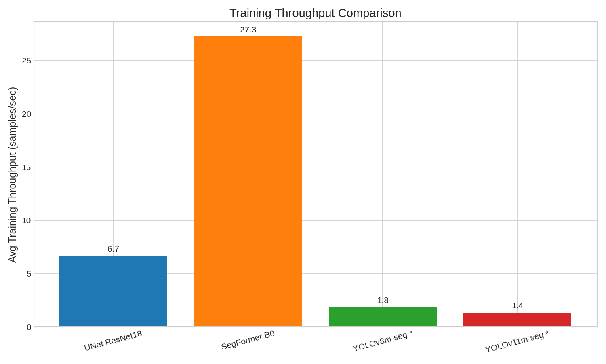

# Models Training Results & Benchmark

**Date**: 2026-03-12  
**Hardware**: NVIDIA GTX 1650 (4 GB VRAM), Linux  
**Training**: 20 epochs, AdamW with Cosine Annealing LR, 512×512  
**Labels**: `michanical_part`, `magnet`, `circle` (multi-class segmentation, 4 classes incl. background)

> **Dataset Note**:  
> - **YOLO models** (YOLOv8m-seg, YOLOv11m-seg) were trained on **augmented data** (3,460 images — 10× augmentation: 2 geometric × 5 photometric, no rotation).  
> - **PyTorch models** (UNet ResNet18, SegFormer B0) were trained on the **original dataset** (346 images, split 242 train / 51 val / 53 test) due to **hardware constraints** — training on the augmented set is prohibitively slow on a GTX 1650 with 4 GB VRAM.  
> This means YOLO models benefited from ~10× more training samples, which should be taken into account when comparing accuracy metrics.

---

## 1. Models Trained

| Model | Architecture | Type | Framework | Training Data |
|-------|-------------|------|-----------|---------------|
| UNet ResNet18 | Encoder–Decoder with ResNet18 backbone | Multi-class segmentation | PyTorch | Original (346 images) |
| SegFormer B0 | Transformer-based (Mix-FFN, hierarchical) | Multi-class segmentation | PyTorch | Original (346 images) |
| YOLOv8m-seg | CSPDarknet + C2f, Medium | Instance segmentation | Ultralytics | Augmented (3,460 images) |
| YOLOv11m-seg | Improved CSP + C3k2, Medium | Instance segmentation | Ultralytics | Augmented (3,460 images) |

---

## 2. Best Validation Results

| Model | Best IoU | Best Val Loss | Best Epoch | Accuracy | Dice | Precision | Recall | Dataset |
|-------|----------|--------------|------------|----------|------|-----------|--------|---------|
| **UNet ResNet18** | **0.8763** | 0.3166 | 19 | 98.64% | 0.9324 | 0.9545 | 0.9835 | Original |
| YOLOv8m-seg | 0.8569 | — | 20 | — | — | 0.9922 (M) | 0.9956 (M) | Augmented |
| YOLOv11m-seg | 0.8476 | — | 20 | — | — | 0.9902 (M) | 0.9970 (M) | Augmented |
| SegFormer B0 | 0.5954 | 0.2674 | 20 | 95.57% | 0.7169 | 0.8562 | 0.9051 | Original |

> **Winner by IoU**: UNet ResNet18 (0.8763) — achieves the highest IoU even on the smaller original dataset (346 images), surpassing YOLO models trained on 10× more data.

### YOLO-Specific Metrics (Epoch 20)

| Model | mAP50 (Box) | mAP50-95 (Box) | mAP50 (Mask) | mAP50-95 (Mask) |
|-------|-------------|----------------|--------------|-----------------|
| YOLOv8m-seg | 0.9916 | 0.8968 | 0.9916 | 0.8569 |
| YOLOv11m-seg | 0.9932 | 0.8881 | 0.9932 | 0.8476 |

---

## 3. Training Efficiency

| Model | Dataset | Total Train Time | Time / Epoch | Peak GPU (MB) | Avg GPU Util. |
|-------|---------|-----------------|--------------|---------------|---------------|
| **SegFormer B0** | Original | **3.0 min** | ~9 s | 1,962 | 86.0% |
| UNet ResNet18 | Original | 12.4 min | ~40 s | 3,585 | 96.1% |
| YOLOv8m-seg | Augmented | 1 h 52 min | ~337 s | 4,086 | 83.2% |
| YOLOv11m-seg | Augmented | 2 h 32 min | ~455 s | 3,975 | 81.1% |

> **Fastest model**: SegFormer B0 — 4× faster than UNet, ~37× faster than YOLOv8m.  
> **Most memory-efficient**: SegFormer B0 — uses about half the GPU memory of the others.  
> **Note**: YOLO training times are higher partly because they process 10× more data per epoch (augmented dataset).

---

## 4. Convergence Analysis

### UNet ResNet18 (Original Data — 346 images)
- Steady convergence: IoU climbs from 0.5556 (epoch 1) to 0.8763 (epoch 19).
- Highest val Dice (0.9324) and precision (0.9545) among all models.
- Training saturates around epoch 17–19 with diminishing returns.

### SegFormer B0 (Original Data — 346 images)
- Gradual improvement: IoU goes from 0.3647 (epoch 1) to 0.5954 (epoch 20) — still improving at training end.
- Lowest training time (3 min) and GPU memory (1,962 MB).
- May benefit from more epochs or data augmentation to close the gap.

### YOLOv8m-seg (Augmented Data — 3,460 images)
- mAP50 (Mask) reached 0.9544 in epoch 1, plateauing near 0.9916 by epoch 20.
- Very high precision/recall on detection (>0.99), but mask IoU (mAP50-95) at 0.8569.
- Benefits from the large augmented dataset.

### YOLOv11m-seg (Augmented Data — 3,460 images)
- Similar trajectory to YOLOv8m but 35% slower training time.
- Slightly lower mAP50-95 (Mask) than YOLOv8m (0.8476 vs 0.8569).
- Highest recall among all models (0.9970).

---

## 5. Comparison Plots

All plots include all 4 models (UNet ResNet18, SegFormer B0, YOLOv8m-seg, YOLOv11m-seg) and are stored in `outputs/results/plots/`.

### 5.1 Comprehensive Comparison

*9-panel dashboard comparing all models across key metrics. YOLO models (marked with *) were trained on augmented data.*

### 5.2 Best IoU Comparison

*Bar chart of best validation IoU for each model. UNet leads despite training on 10× less data than YOLO.*

### 5.3 IoU Curves

*Validation IoU progression over 20 epochs. UNet converges to 0.87+; YOLO models plateau near 0.85.*

### 5.4 Loss Curves

*Validation loss over epochs. Note: YOLO loss (seg+box) is not directly comparable to PyTorch CE+Dice loss.*

### 5.5 Dice / mAP50 Curves

*Validation Dice (PyTorch) and mAP50-Mask (YOLO) progression.*

### 5.6 Training Time

*Total training time per model. YOLO models take significantly longer partly due to 10× more data.*

### 5.7 Accuracy vs Speed

*Bubble chart: IoU vs training time (bubble size = GPU memory). UNet offers the best accuracy/time tradeoff.*

### 5.8 Throughput

*Average training throughput (images/sec). SegFormer is the fastest at ~27 img/s.*

### 5.9 GPU Usage

*GPU memory and utilization over training epochs.*

### 5.10 Final Comparison Table

*Summary table visualization comparing all models side by side, including dataset information.*

---

## 6. YOLO-Specific Plots

Each YOLO model produces additional curves stored in its training folder.

### YOLOv8m-seg

| Plot | Preview |
|------|---------|
| Training overview |  |
| Confusion matrix |  |
| Mask PR curve |  |
| Mask F1 curve |  |
| Label distribution |  |

### YOLOv11m-seg

| Plot | Preview |
|------|---------|
| Training overview |  |
| Confusion matrix |  |
| Mask PR curve |  |
| Mask F1 curve |  |
| Label distribution |  |

---

## 7. Detection Examples

All examples use test image `run_001_00003` (640×480) containing **7 objects**: 1 circle, 2 magnets, 4 mechanical parts. Measurements use **manual calibration** (1 px = 1 mm).

### 7.1 All Models — Segmentation Comparison

*Side-by-side: YOLO models produce instance masks + bounding boxes; PyTorch models produce pixel-level multi-class masks.*

### 7.2 All Models — With Measurements (1 px = 1 mm)

*Same detections with measurement overlay enabled. Width, height, diameter lines drawn per detection.*

### 7.3 Per-Model Detail

#### YOLOv8m-seg (7 detections)

| Segmentation | With Measurements |
|---|---|
|  |  |

| # | Class | Confidence |
|---|-------|-----------|
| 1 | circle | 96.85% |
| 2 | magnet | 93.05% |
| 3 | magnet | 92.54% |
| 4 | michanical_part | 89.02% |
| 5 | michanical_part | 88.19% |
| 6 | michanical_part | 87.67% |
| 7 | michanical_part | 85.63% |

#### YOLOv11m-seg (7 detections)

| Segmentation | With Measurements |
|---|---|
|  |  |

| # | Class | Confidence |
|---|-------|-----------|
| 1 | circle | 95.87% |
| 2 | magnet | 91.37% |
| 3 | magnet | 90.39% |
| 4 | michanical_part | 87.02% |
| 5 | michanical_part | 85.30% |
| 6 | michanical_part | 82.33% |
| 7 | michanical_part | 82.05% |

#### UNet ResNet18 (7 detections)

| Segmentation | With Measurements |
|---|---|
|  |  |

| # | Class | Confidence |
|---|-------|-----------|
| 1 | michanical_part | 93.39% |
| 2 | michanical_part | 89.88% |
| 3 | michanical_part | 93.33% |
| 4 | michanical_part | 91.41% |
| 5 | magnet | 92.29% |
| 6 | magnet | 93.33% |
| 7 | circle | 86.02% |

#### SegFormer B0 (8 detections)

| Segmentation | With Measurements |
|---|---|
|  |  |

| # | Class | Confidence |
|---|-------|-----------|
| 1 | michanical_part | 79.44% |
| 2 | michanical_part | 77.15% |
| 3 | michanical_part | 87.51% |
| 4 | michanical_part | 78.17% |
| 5 | magnet | 44.55% |
| 6 | magnet | 76.33% |
| 7 | magnet | 84.96% |
| 8 | circle | 93.61% |

> SegFormer detects 8 objects (1 extra spurious magnet region) with generally lower confidence, consistent with its lower IoU.

> **Note**: Measurements use a dummy 1 px = 1 mm calibration for demonstration. In production, use **Camera Intrinsics**, **Reference Label**, or a real-world calibration factor.

---

## 8. Key Takeaways

| Criterion | Best Model | Value | Dataset |
|-----------|-----------|-------|---------|
| Highest IoU | UNet ResNet18 | 0.8763 | Original (346) |
| Lowest Val Loss | SegFormer B0 | 0.2674 | Original (346) |
| Fastest Training | SegFormer B0 | 3.0 min | Original (346) |
| Lowest GPU Memory | SegFormer B0 | 1,962 MB | Original (346) |
| Best Precision (instance) | YOLOv8m-seg | 0.9922 | Augmented (3,460) |
| Best Recall (instance) | YOLOv11m-seg | 0.9970 | Augmented (3,460) |
| Best mAP50 | YOLOv11m-seg | 0.9932 | Augmented (3,460) |

### Why Different Datasets?

YOLO models (YOLOv8m-seg, YOLOv11m-seg) were trained on the **augmented dataset** (3,460 images) because they were trained first during initial experiments. When re-training the PyTorch models (UNet ResNet18, SegFormer B0) as multi-class, we used the **original dataset** (346 images) because **hardware constraints** (GTX 1650, 4 GB VRAM) made training on the full augmented set prohibitively slow — each epoch takes significantly longer with 10× the data, and the limited VRAM further restricts batch size and throughput.

Despite this data disadvantage, **UNet ResNet18 still achieves the highest IoU (0.8763)**, outperforming both YOLO models that had 10× more training data.

### Recommendations

- **Best overall accuracy**: Use **UNet ResNet18** — highest IoU (0.8763) and Dice (0.9324) even on the smaller dataset.
- **Resource-constrained / fast iteration**: Use **SegFormer B0** — trains in 3 min with half the GPU memory, though IoU is lower.
- **Multi-class instance detection**: Use **YOLOv8m-seg** — best mAP50-95 mask score with per-class bounding boxes.
- **All models** are deployable via the web application — select from the model dropdown at runtime.
