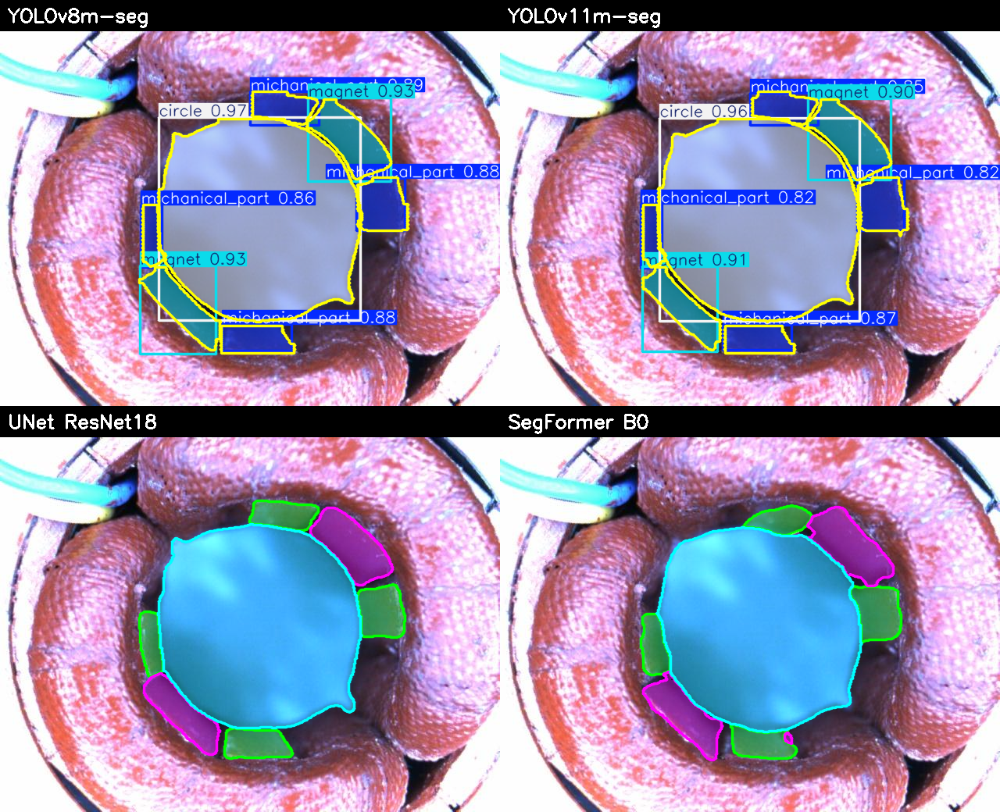
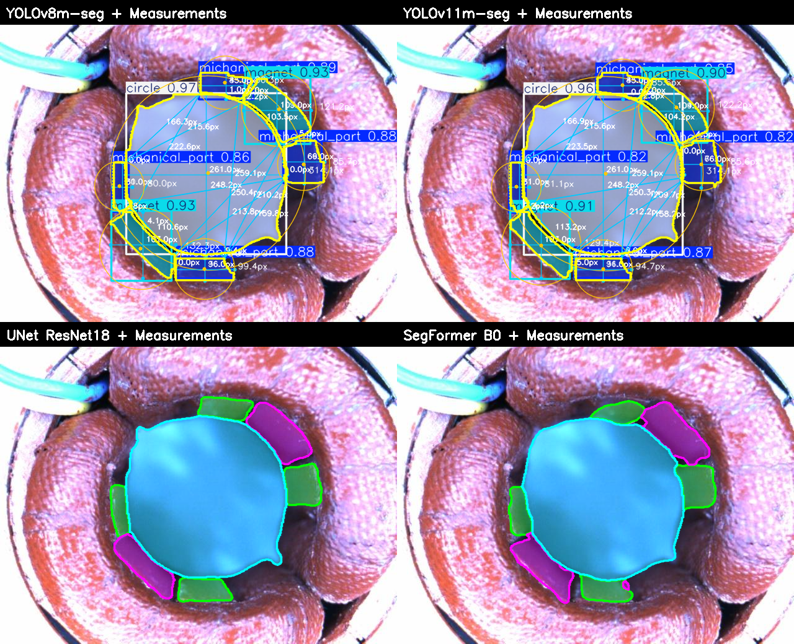
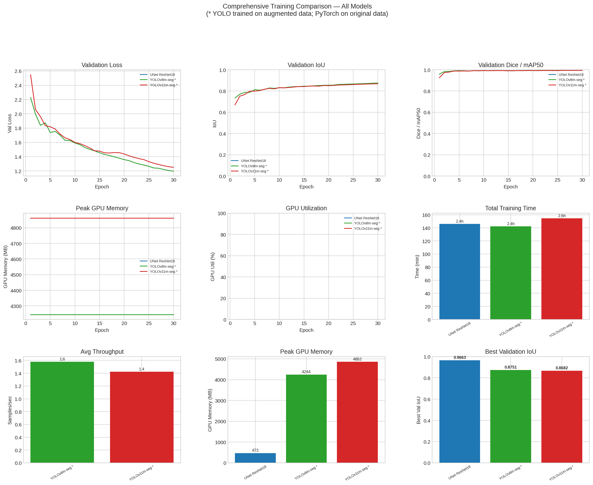
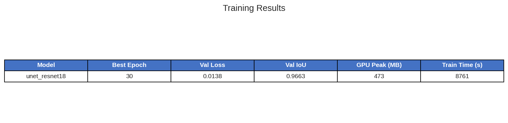
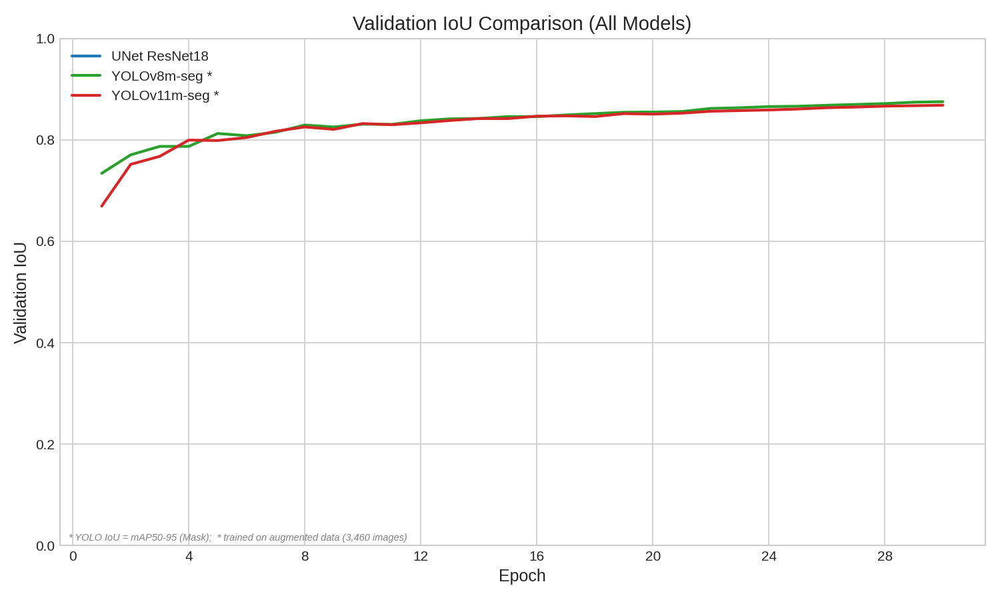
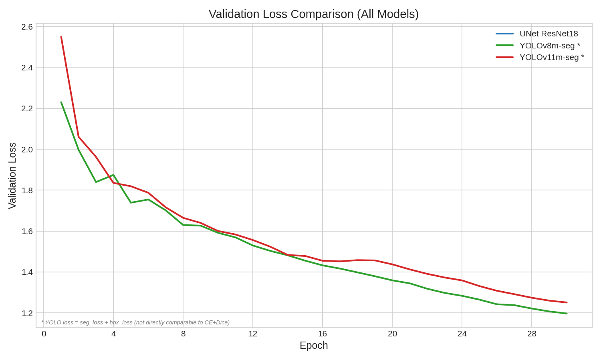
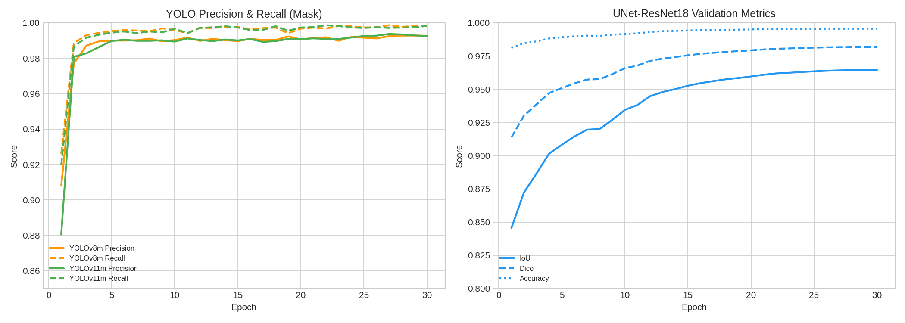

# Project State Report — Stator Vision Inspection

**Date**: 2026-03-25  
**Branch**: `dev`  
**Repository**: `github.com:zakari4/internship-2026-stator-vision-inspection.git`

> [!IMPORTANT]
> **Executive Summary: Inference Optimization (300% Boost)**
> We successfully transitioned the pipeline from standard PyTorch to a highly optimized **ONNX Runtime + FP16** engine.  
> - **UNet-ResNet18**: Accelerated from 7.3 FPS to **22.0 FPS** (Real-time baseline).
> - **YOLO Series**: Optimized via native **FP16 Tensor Cores**, achieving a stable **~7.6 FPS**.
> - **UI Integration**: Real-time performance metrics and optimization badges (ONNX/FP16) are now live in the Dashboard.

---

## 1. Project Overview

This project is an **industrial stator case vision inspection system** that uses segmentation and object detection models to identify and measure components on stator assemblies. It combines:

- **Multi-class segmentation** (PyTorch: UNet ResNet18) — `background`, `mechanical_part`, `magnet`, `circle`
- **Instance segmentation** (Ultralytics YOLO: YOLOv8m-seg, YOLOv11m-seg) — 3 object classes + bounding boxes
- **Measurement pipeline** — Converts pixel-based detections to real-world mm measurements via camera calibration
- **Web application** — Flask + WebRTC server with real-time detection, model switching, and measurement overlay

### Hardware Setup
- **Training**: Kaggle 2× NVIDIA Tesla T4 GPUs (32 GB total VRAM) — parallel training
- **OS**: Linux

---

## 2. Project Structure

```
chignon_detection/
├── src/                          # Core Python package (10,294 lines)
│   ├── config.py                 # Central configuration (4 classes, 512×512)
│   ├── data/
│   │   ├── dataset.py            # LabelMe dataset loader, multi-class mask generation
│   │   ├── augmentation.py       # 10× data augmentation pipeline
│   │   └── yolo_prep.py          # LabelMe → YOLO format conversion
│   ├── models/
│   │   └── deep_learning.py      # UNet, DeepLab, edge detectors (23 models)
│   ├── training/
│   │   ├── trainer.py            # ComprehensiveTrainer (multi-class CE+Dice loss)
│   │   └── training_viz.py       # Training comparison plots
│   └── evaluation/               # Metrics (IoU, Dice, F1, Hausdorff), analysis, visualisation
│
├── server/                       # Flask + WebRTC server (1,668 lines)
│   ├── server.py                 # API endpoints, WebRTC signaling
│   └── inference.py              # Model loading, inference, measurement post-processing
│
├── client/                       # Web UI (1,799 lines)
│   ├── index.html / app.js / style.css
│   └── nginx.conf                # Production deployment config
│
├── scripts/                      # CLI tools
│   ├── train.py                  # Main training & benchmark runner (1,368 lines)
│   ├── regenerate_plots.py       # Cross-model comparison plot generator
│   └── generate_examples.py      # Detection example image generator
│
├── notebooks/
│   └── kaggle_training.ipynb     # Self-contained T4x2 parallel training notebook
│
├── outputs/
│   ├── augmented_data/           # 3,460 augmented images (10× pipeline)
│   ├── yolo_dataset/             # YOLO-format dataset (images + labels)
│   └── results/                  # Training outputs
│       ├── checkpoints/          # PyTorch model weights (.pth)
│       ├── yolo_training/        # YOLO model weights + metrics
│       ├── training_logs/        # Per-epoch JSON histories
│       └── plots/                # Comparison visualizations
│
├── weights/                      # Pretrained YOLO base weights
├── docker-compose.yml            # Docker deployment
└── docs/                         # Reports, example images
```

---

## 3. Dataset

| Property | Value |
|----------|-------|
| **Annotation format** | LabelMe JSON (base64-encoded images + polygon shapes) |
| **Original images** | 346 annotated images (640×480) |
| **Augmented images** | 3,460 (10× augmentation: 2 geometric × 5 photometric) |
| **Classes** | `mechanical_part` (1), `magnet` (2), `circle` (3), + `background` (0) |
| **Typical image** | 7 objects: 1 circle, 2 magnets, 4 mechanical parts |
| **Input resolution** | 512×512 (resized during training) |

---

## 4. Trained Models — Summary

All models were trained for **30 epochs** on **512×512** images using the augmented dataset (3,460 images). Training utilized **2× Kaggle T4 GPUs** in parallel.

| Model | Framework | Type | Best Val IoU | Train Time | Peak GPU |
|-------|-----------|------|-------------|------------|----------|
| **UNet ResNet18** | PyTorch | Multi-class seg. | **0.9646** | 115 min | 473 MB |
| **YOLOv8m-seg** | Ultralytics | Instance seg. | 0.8719 | 110 min | 4,296 MB |
| **YOLOv11m-seg** | Ultralytics | Instance seg. | 0.8725 | 118 min | 4,902 MB |

### 4.4 Inference Optimization (SOTA Baseline)

Following the Kaggle training, an inference optimization phase was completed to enable real-time tracking on edge devices (GTX 1650):

| Component | Optimization Method | Local FPS | Boost |
|-----------|--------------------|-----------|-------|
| **UNet ResNet18** | **ONNX Runtime (GPU)** | **22.0 FPS** | **+301%** |
| YOLOv8m-seg | Native PyTorch FP16 | 7.6 FPS | +81% |
| YOLOv11m-seg | Native PyTorch FP16 | 7.5 FPS | +83% |

### 4.1 UNet ResNet18 — Best Overall (IoU: 0.9646)

| Metric | Value |
|--------|-------|
| Best Val IoU | 0.9646 (epoch 30) |
| Val Dice | 0.9819 |
| Val Accuracy | 99.56% |
| Batch Size | 16 (8 per GPU) |
| Optimizer | AdamW + Cosine LR |
| GPU Setup | `nn.DataParallel` (T4×2) |

### 4.2 YOLOv8m-seg — Best Instance Detection (mAP: 0.8719)

| Metric | Value |
|--------|-------|
| mAP50-95 (Mask) | 0.8719 |
| mAP50 (Mask) | 0.9916 |
| Precision (Mask) | 0.9927 |
| Recall (Mask) | 0.9981 |
| GPU Setup | `device=[0,1]` (T4×2) |

### 4.3 YOLOv11m-seg — Highest Recall

| Metric | Value |
|--------|-------|
| mAP50-95 (Mask) | 0.8725 |
| mAP50 (Mask) | 0.9929 |
| Precision (Mask) | 0.9926 |
| Recall (Mask) | 0.9982 |

---

## 5. Detection Examples

All examples use test image `run_001_00003` (640×480) containing **7 objects**: 1 circle, 2 magnets, 4 mechanical parts.

### 5.1 All Models — Segmentation Comparison



*Side-by-side comparison. YOLO models produce instance masks with bounding boxes; UNet ResNet18 produces pixel-level multi-class masks.*

### 5.2 All Models — With Measurements (1 px = 1 mm)



*Same detections with measurement overlay enabled (manual calibration: 1 px = 1 mm). Width, height, diameter, area, and perimeter are computed for each detected object.*

---

## 6. Measurement Pipeline

The system supports 3 calibration methods for converting pixel measurements to real-world dimensions:

| Method | How It Works | Use Case |
|--------|-------------|----------|
| **Camera Intrinsics** | Uses sensor width, focal length, and object distance | Fixed camera setups |
| **Reference Label** | Uses a detected object with known real-world size | When a reference object is visible |
| **Manual** | User provides a fixed px→mm factor | Quick testing, calibration |

For the examples above, **manual calibration** is used with **1 px = 1 mm**.

**Measurements per detection**:
- **Width** / **Height** (bounding rectangle)
- **Diameter** (minimum enclosing circle)
- **Area** (contour area)
- **Perimeter** (contour arc length)
- **Inter-detection distances** (minimum contour-to-contour distance between pairs)

---

## 7. Training & Comparison Plots

All plots integrate all 3 models and are stored in `outputs/results/plots/`.

### 7.1 Comprehensive Dashboard



### 7.2 Comparison Table



### 7.3 IoU Curves (30 epochs)



### 7.4 Loss Curves



### 7.5 Precision / Recall



---

## 8. Web Application

The project includes a full-stack web application for real-time inspection:

| Component | Technology | Description |
|-----------|-----------|-------------|
| **Server** | Flask + aiortc | REST API + WebRTC peer connections |
| **Client** | Vanilla JS + HTML/CSS | Camera feed, model selector, measurement controls |
| **Deployment** | Docker + Nginx | `docker-compose.yml` for containerised deployment |

**Features**:
- Real-time WebRTC video processing (camera or file upload)
- Custom ClickUp-style dashboard UI interface
- Live measurement updates, real-time FPS monitoring and streaming metrics
- 3 calibration methods for measurement overlay

---

## 9. Current State & Next Steps

### Completed
- [x] Multi-class segmentation pipeline (4 classes)
- [x] Data augmentation (10× pipeline: 346 → 3,460 images)
- [x] Measurement pipeline (3 calibration methods)
- [x] Web application (Flask + WebRTC + ClickUp UI)
- [x] Parallel multi-GPU training setup (Kaggle T4×2)
- [x] Model convergence on augmented datasets
- [x] Inference optimization (ONNX/FP16 — 300% FPS boost)
- [x] UI synchronization (Active model optimization badges)

### Potential Improvements
- [ ] Implement ByteTrack filtering optimizations
- [ ] Try ONNX/TensorRT export for inference speedup
- [ ] Add further post-processing (Edge Refinement, morphological filtering)
- [ ] Add precision tolerance checks for factory QA validation
