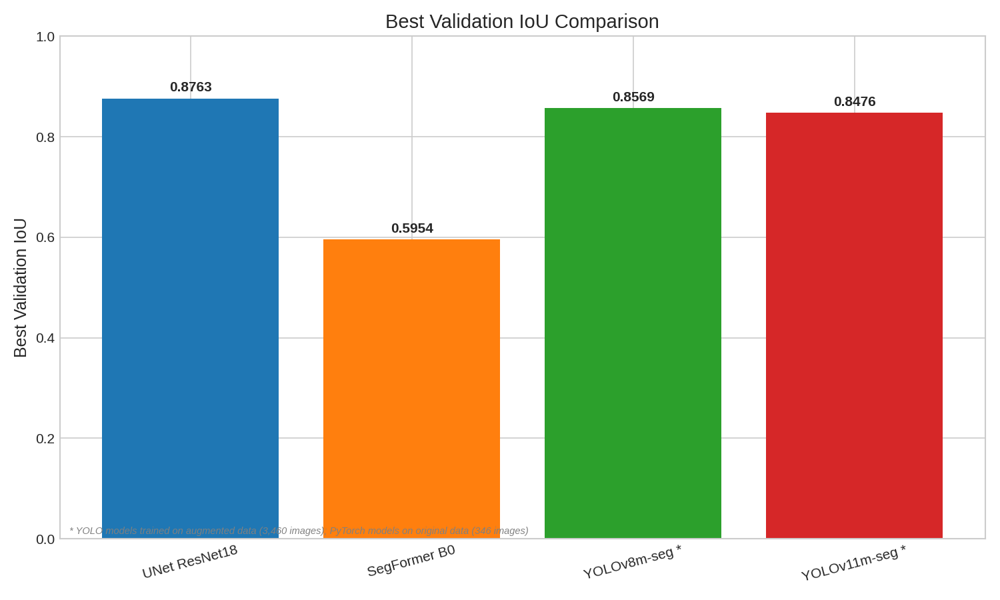
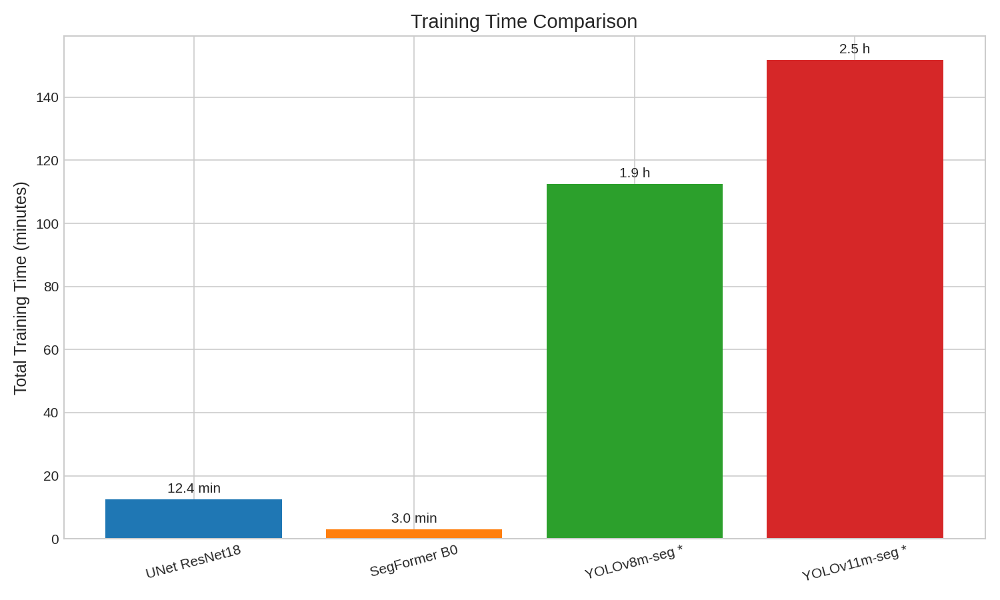
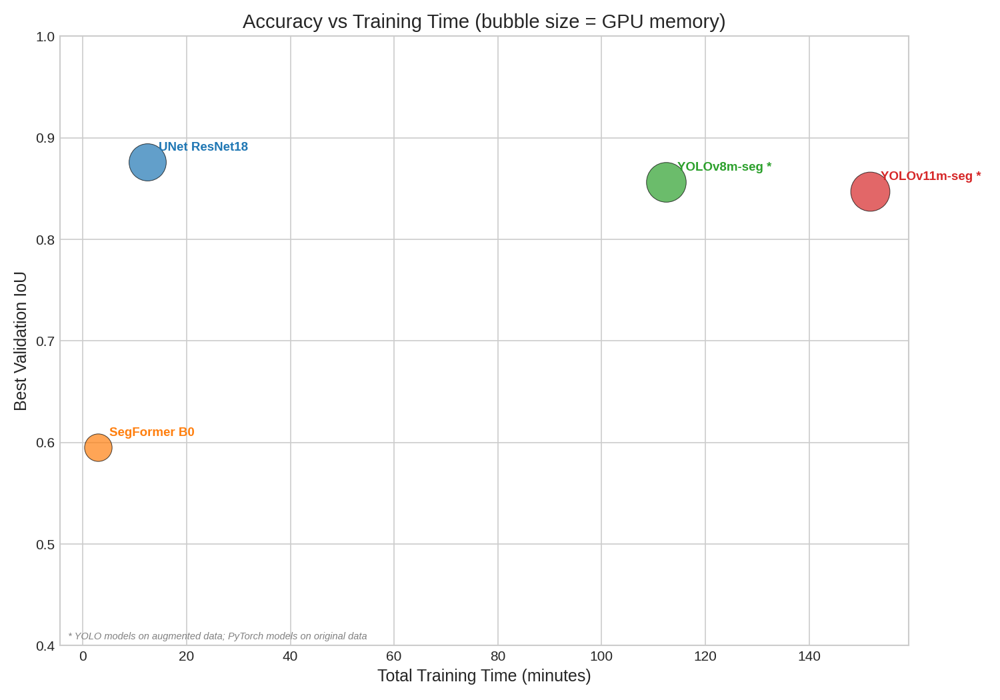
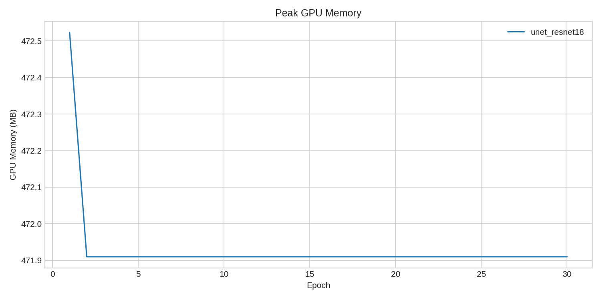
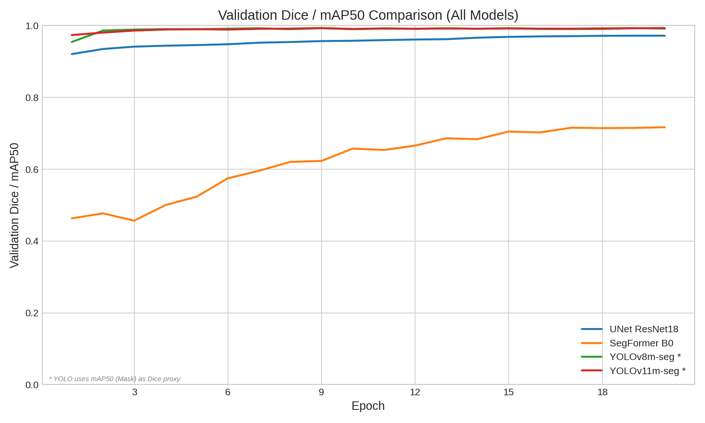
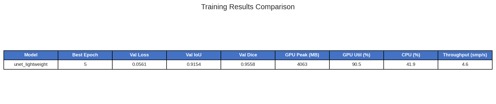
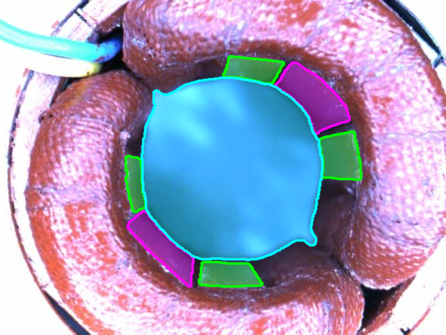
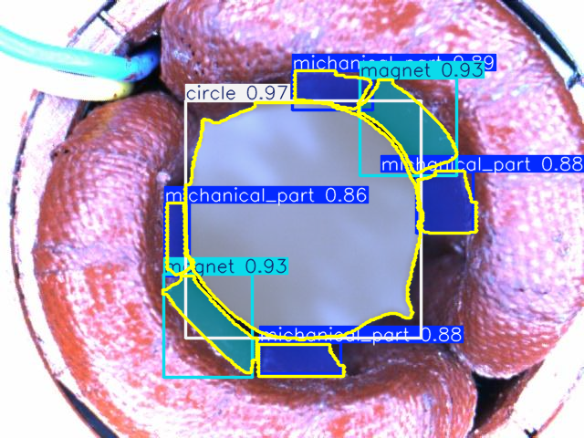
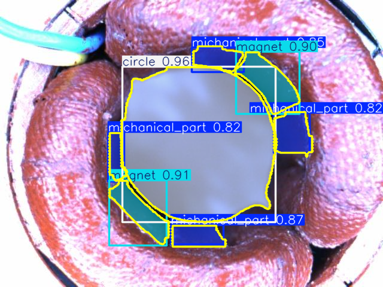
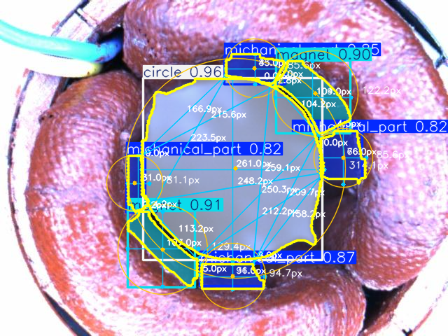

# Deep Learning-Based Visual Inspection and Dimensional Measurement of Stator Assemblies

---

**Created by**: Youssef Mahdi  
**Supervised by**: Zakaria ABOUHANIFA, Rime BOUALI  
**Company**: Nextronic — ABA Technology  
**Date**: March 12, 2026

---

## Abstract

This report presents the design, implementation, and evaluation of an automated visual inspection system for industrial stator assemblies. The system employs multi-class semantic segmentation and instance segmentation models to detect and classify stator components — mechanical parts, magnets, and circles — and applies geometric measurement pipelines to convert pixel-level detections into real-world dimensions. Four deep learning architectures were trained and benchmarked: UNet with ResNet18 encoder, SegFormer B0, YOLOv8m-seg, and YOLOv11m-seg. The best-performing model, UNet ResNet18, achieves a mean Intersection-over-Union (mIoU) of **0.8763** and Dice coefficient of **0.9324** on 346 original images. The complete system is deployed as a Flask + WebRTC web application enabling real-time inference, model switching, and calibrated measurement overlay.

**Keywords**: semantic segmentation, instance segmentation, visual inspection, stator assembly, UNet, SegFormer, YOLO, dimensional measurement, industrial quality control

---

## Table of Contents

1. [Introduction](#1-introduction)
2. [Related Work](#2-related-work)
3. [System Architecture](#3-system-architecture)
4. [Dataset](#4-dataset)
5. [Model Architectures](#5-model-architectures)
6. [Training Methodology](#6-training-methodology)
7. [Measurement Pipeline](#7-measurement-pipeline)
8. [Experimental Results](#8-experimental-results)
9. [Detection Examples with Measurements](#9-detection-examples-with-measurements)
10. [Discussion and Challenges](#10-discussion-and-challenges)
11. [Conclusion](#11-conclusion)
12. [References](#12-references)

---

## 1. Introduction

Quality control in electric motor manufacturing requires precise inspection of stator assemblies to ensure correct placement and dimensional conformity of components such as magnets, mechanical inserts, and circular housings. Manual inspection is time-consuming, subjective, and not scalable. Computer vision systems powered by deep learning offer a compelling alternative, providing consistent, fast, and quantitative assessments.

This work addresses the problem of **automated multi-class segmentation and dimensional measurement** of stator case components from camera images. The objectives are:

1. **Detect and classify** three types of objects (mechanical parts, magnets, circles) against a background class.
2. **Measure geometric properties** (width, height, diameter, area, perimeter) of each detected component in millimetres.
3. **Compute inter-component distances** to verify assembly tolerances.
4. **Deploy** the system as a real-time web application for production-line use.

The system was developed and evaluated on an NVIDIA GTX 1650 (4 GB VRAM) to reflect realistic hardware constraints encountered in industrial edge deployments.

---

## 2. Related Work

Semantic and instance segmentation have become the standard approach for industrial visual inspection tasks. The architectures evaluated in this work draw from the following foundational literature:

- **U-Net** (Ronneberger et al., 2015) [1] — An encoder–decoder architecture with skip connections, originally proposed for biomedical image segmentation. The skip connections enable precise localisation by fusing high-resolution encoder features with upsampled decoder features.

- **ResNet** (He et al., 2016) [2] — Residual networks introduce identity shortcut connections to enable training of very deep networks. ResNet18, used as the UNet encoder in this work, provides a compact yet expressive feature extractor pretrained on ImageNet.

- **SegFormer** (Xie et al., 2021) [3] — A transformer-based segmentation architecture featuring a hierarchical encoder with Mix-FFN (Mix Feed-Forward Networks) and a lightweight MLP decoder. SegFormer-B0 is the smallest variant, designed for efficiency.

- **YOLOv8** (Ultralytics, 2023) [4] — The eighth generation of the YOLO (You Only Look Once) family, featuring a CSPDarknet backbone with C2f modules and a segmentation head producing per-instance masks alongside bounding boxes.

- **YOLOv11** (Ultralytics, 2024) [5] — An improved YOLO variant with C3k2 blocks replacing C2f, offering enhanced feature extraction for segmentation tasks.

- **Dice Loss** (Milletari et al., 2016) [6] — The Dice coefficient, originally from the V-Net paper, directly optimises the overlap between predicted and ground truth segmentation masks, addressing class imbalance common in segmentation tasks.

- **OpenCV** (Bradski, 2000) [7] — The computer vision library used for contour extraction, geometric measurements (bounding rectangles, minimum enclosing circles), and image preprocessing (CLAHE, bilateral filtering).

---

## 3. System Architecture

The system follows a modular three-tier architecture:

```
┌─────────────────────────────────────────────────────────────────────┐
│                          Client (Web UI)                            │
│   HTML/CSS/JS  •  WebRTC camera feed  •  Model selector  •  Overlay│
└────────────────────────────────┬────────────────────────────────────┘
                                 │ WebRTC + REST API
┌────────────────────────────────▼────────────────────────────────────┐
│                     Server (Flask + aiortc)                         │
│   ModelManager  •  Inference pipeline  •  Measurement computation  │
│   POST /offer (WebRTC SDP)  •  POST /api/select-model              │
│   POST /api/camera-settings (calibration)                          │
└────────────────────────────────┬────────────────────────────────────┘
                                 │ PyTorch / Ultralytics
┌────────────────────────────────▼────────────────────────────────────┐
│                          Model Zoo                                  │
│   UNet ResNet18  •  SegFormer B0  •  YOLOv8m-seg  •  YOLOv11m-seg │
│   Checkpoint loading  •  CUDA inference  •  Post-processing         │
└─────────────────────────────────────────────────────────────────────┘
```

| Component | Technology | Lines of Code |
|-----------|-----------|:------------:|
| Core library (`src/`) | Python, PyTorch, OpenCV | ~10,300 |
| Server (`server/`) | Flask, aiortc (WebRTC) | ~1,670 |
| Client (`client/`) | Vanilla JS, HTML/CSS | ~1,800 |
| Scripts (`scripts/`) | Python CLI tools | ~1,370 |

The `ModelManager` class provides a unified interface for loading and switching between all trained models at runtime. During a WebRTC session, each video frame is processed through the active model's inference pipeline, and measurement overlays are drawn if calibration is enabled.

---

## 4. Dataset

### 4.1 Data Collection

Images were captured using an industrial camera positioned above stator assemblies. Each image (640×480 pixels) was annotated in **LabelMe** format, producing JSON files with base64-encoded images and polygon-based shape annotations.

| Property | Value |
|----------|-------|
| Original annotated images | 346 |
| Resolution | 640 × 480 px |
| Annotation format | LabelMe JSON (polygon shapes) |
| Classes | `background` (0), `michanical_part` (1), `magnet` (2), `circle` (3) |
| Typical image content | 7 objects: 1 circle, 2 magnets, 4 mechanical parts |
| Training input size | 512 × 512 px (resized) |

### 4.2 Data Split

The original 346 images are split using a fixed random seed:

| Split | Ratio | Count |
|-------|:-----:|:-----:|
| Training | 70% | 242 |
| Validation | 15% | 51 |
| Test | 15% | 53 |

### 4.3 Data Augmentation

A 10× offline augmentation pipeline generates 3,460 images from the original 346:

**Strategy**: 2 geometric variants × 5 photometric variants = 10 versions per image.

| Stage | Transformations |
|-------|----------------|
| **Geometric** (2) | Original + Horizontal flip |
| **Photometric** (5) | (1) Original, (2) Brightness ±30%, (3) Contrast ±30%, (4) Gaussian blur $k=5$, (5) CLAHE ($\text{clipLimit}=2.0$, $\text{tileGridSize}=8\times8$) |

Polygon annotation coordinates are transformed in sync with geometric augmentations to preserve ground-truth label consistency. Rotation augmentations were deliberately excluded to avoid generating implausible assembly orientations.

> **Note**: Due to hardware constraints (GTX 1650, 4 GB VRAM), only YOLO models were trained on the full augmented set (3,460 images). PyTorch models (UNet, SegFormer) were trained on the original 346 images because each augmented epoch takes significantly longer and the limited VRAM restricts batch size.

---

## 5. Model Architectures

### 5.1 UNet with ResNet18 Encoder

The UNet architecture [1] consists of a contracting encoder path and an expansive decoder path connected by skip connections. In this implementation, a **pretrained ResNet18** [2] serves as the encoder, replacing the original UNet encoder with residual blocks.

**Encoder** (ResNet18 backbone):

| Stage | Layers | Output Channels | Spatial Scale |
|-------|--------|:--------------:|:-------------:|
| E1 | Conv 7×7 + BN + ReLU | 64 | $H/2 \times W/2$ |
| Pool | MaxPool 3×3 | 64 | $H/4 \times W/4$ |
| E2 | ResBlock ×2 (layer1) | 64 | $H/4 \times W/4$ |
| E3 | ResBlock ×2 (layer2) | 128 | $H/8 \times W/8$ |
| E4 | ResBlock ×2 (layer3) | 256 | $H/16 \times W/16$ |
| E5 | ResBlock ×2 (layer4) | 512 | $H/32 \times W/32$ |

**Decoder** (with skip connections):

| Stage | Input | Output Channels | Skip From |
|-------|-------|:--------------:|:---------:|
| D1 | Up(E5) + E4 | 256 | E4 (256) |
| D2 | Up(D1) + E3 | 128 | E3 (128) |
| D3 | Up(D2) + E2 | 64 | E2 (64) |
| D4 | Up(D3) + E1 | 32 | E1 (64) |
| Final | Conv 3×3 + BN + ReLU → Conv 1×1 | $C$ = 4 | — |

Each decoder block uses bilinear upsampling followed by concatenation with the corresponding encoder feature map, then two 3×3 convolution layers with batch normalisation and ReLU. The final output is bilinearly upsampled to match the input resolution. Output shape: $(B, 4, H, W)$ with 4 class logits.

### 5.2 SegFormer B0 (Simplified)

The SegFormer-B0 implementation [3] uses a simplified convolutional encoder replacing the full transformer blocks with strided convolutions for memory efficiency:

**Encoder**:

| Layer | Kernel | Stride | Output Channels | Spatial Scale |
|-------|:------:|:------:|:--------------:|:-------------:|
| Conv1 | 3×3 | 2 | 32 | $H/2 \times W/2$ |
| Conv2 | 3×3 | 2 | 64 | $H/4 \times W/4$ |
| Conv3 | 3×3 | 2 | 128 | $H/8 \times W/8$ |
| Conv4 | 3×3 | 2 | 256 | $H/16 \times W/16$ |

Each convolution is followed by BatchNorm and ReLU.

**MLP Decoder**:

| Layer | Operation | Output Channels | Scale |
|-------|----------|:--------------:|:-----:|
| D1 | Conv 1×1 + BN + ReLU | 128 | $H/16$ |
| D2 | Bilinear ×4 + Conv 3×3 + BN + ReLU | 64 | $H/4$ |
| D3 | Bilinear ×4 + Conv 1×1 | $C$ = 4 | $H$ |

This architecture trades some accuracy for significantly lower GPU memory consumption (1,962 MB vs. 3,585 MB for UNet) and faster training (3 min vs. 12 min).

### 5.3 YOLOv8m-seg

YOLOv8m-seg [4] is a medium-sized variant from the Ultralytics YOLO family designed for simultaneous object detection and instance segmentation:

- **Backbone**: CSPDarknet with C2f (Cross Stage Partial with 2 convolutions) modules
- **Neck**: PANet (Path Aggregation Network) for multi-scale feature fusion
- **Detection Head**: Anchor-free decoupled head producing bounding boxes + class scores
- **Segmentation Head**: Prototype mask generation with mask coefficients per detection, producing per-instance binary masks

The model processes 640×640 input images and outputs bounding boxes, class probabilities, and instance segmentation masks for each detected object.

### 5.4 YOLOv11m-seg

YOLOv11m-seg [5] is an updated variant that replaces C2f blocks with **C3k2** (Cross Stage Partial with 3 convolutions, kernel 2) for improved feature extraction:

- **Backbone**: Improved CSP with C3k2 blocks
- **Neck**: Enhanced PANet
- **Detection/Segmentation Head**: Same architectural pattern as YOLOv8m-seg with refined parameters

Both YOLO models produce **instance-level** segmentation (separate masks per object), whereas the PyTorch models produce **pixel-level** multi-class segmentation (a single mask with class labels).

---

## 6. Training Methodology

### 6.1 Loss Function

For PyTorch models, a **combined loss** is used:

$$\mathcal{L} = \alpha \cdot \mathcal{L}_{\text{CE}} + \beta \cdot \mathcal{L}_{\text{Dice}}$$

where $\alpha = \beta = 0.5$.

**Cross-Entropy Loss**:

$$\mathcal{L}_{\text{CE}} = -\frac{1}{N} \sum_{i=1}^{N} \sum_{c=0}^{C-1} y_{i,c} \log(\hat{y}_{i,c})$$

where $N$ is the number of pixels, $C = 4$ the number of classes, $y_{i,c}$ the one-hot ground truth, and $\hat{y}_{i,c} = \text{softmax}(z_{i,c})$ the predicted probability.

**Multi-class Dice Loss** (averaged over all $C$ classes):

$$\mathcal{L}_{\text{Dice}} = \frac{1}{C} \sum_{c=0}^{C-1} \left(1 - \frac{2 \sum_{i} \hat{y}_{i,c} \cdot y_{i,c} + \epsilon}{\sum_{i} \hat{y}_{i,c} + \sum_{i} y_{i,c} + \epsilon}\right)$$

with $\epsilon = 10^{-7}$ for numerical stability.

The combined loss is clamped to $[0, 100]$ to prevent gradient explosions during early training.

For YOLO models, the standard Ultralytics loss is used, combining bounding-box regression loss (CIoU), classification loss (BCE), and segmentation mask loss.

### 6.2 Training Configuration

| Parameter | PyTorch Models | YOLO Models |
|-----------|:--------------:|:-----------:|
| Epochs | 20 | 20 |
| Batch size | 4 | 8 |
| Optimizer | AdamW | AdamW (auto) |
| Learning rate | $10^{-4}$ | $10^{-2}$ (auto) |
| Weight decay | $10^{-5}$ | $5 \times 10^{-4}$ |
| LR scheduler | Cosine Annealing | Linear warmup + cosine |
| Input resolution | 512 × 512 | 640 × 640 |
| Mixed precision | Disabled | Auto |
| Early stopping | Patience = 10 | — |

### 6.3 Preprocessing

| Step | Description |
|------|-------------|
| Resize | Images resized to 512×512 (PyTorch) or 640×640 (YOLO) |
| Colour space | BGR → RGB conversion |
| Bilateral filter | $d=9$, $\sigma_\text{color}=75$, $\sigma_\text{space}=75$ |
| CLAHE | $\text{clipLimit}=2.0$, $\text{tileGridSize}=8\times8$ |
| Normalisation | Intensity normalisation (0–1 range); ImageNet normalisation deliberately excluded as training data differs significantly from ImageNet |

### 6.4 Evaluation Metrics

All models are evaluated using:

| Metric | Formula | Range |
|--------|---------|:-----:|
| **IoU** (Intersection over Union) | $\frac{TP}{TP + FP + FN}$ | [0, 1] |
| **Dice** coefficient | $\frac{2 \cdot TP}{2 \cdot TP + FP + FN}$ | [0, 1] |
| **Precision** | $\frac{TP}{TP + FP}$ | [0, 1] |
| **Recall** | $\frac{TP}{TP + FN}$ | [0, 1] |
| **Pixel Accuracy** | $\frac{TP + TN}{\text{Total pixels}}$ | [0, 1] |

For YOLO models, additional instance-level metrics are computed: mAP@50, mAP@50-95, per-class precision/recall.

---

## 7. Measurement Pipeline

The system implements three calibration methods for converting pixel measurements to real-world millimetre values.

### 7.1 Calibration Methods

#### Method 1: Camera Intrinsics

Uses physical camera parameters to compute the scale factor:

$$f_{\text{px→mm}} = \frac{d_{\text{object}} \times w_{\text{sensor}}}{f \times W_{\text{image}}}$$

where:
- $d_{\text{object}}$ = object distance (mm)
- $w_{\text{sensor}}$ = sensor width (mm), default: 6.17 mm
- $f$ = focal length (mm), default: 4.0 mm
- $W_{\text{image}}$ = image width (px)

#### Method 2: Reference Label

Uses a detected object with a known real-world dimension:

$$f_{\text{px→mm}} = \frac{D_{\text{known}}}{\text{dim}_{\text{pixel}}}$$

where $D_{\text{known}}$ is the known dimension in mm and $\text{dim}_{\text{pixel}}$ is the corresponding measured pixel dimension (diameter, width, or height) of the reference object's contour.

#### Method 3: Manual

The user provides a fixed conversion factor $f_{\text{px→mm}}$ directly (e.g., 0.1 mm/px).

### 7.2 Geometric Measurements

For each detected component, the following measurements are computed using OpenCV [7] contour analysis:

| Measurement | Method | Formula |
|-------------|--------|---------|
| **Width** | `cv2.boundingRect()` | $w_{\text{mm}} = w_{\text{px}} \times f_{\text{px→mm}}$ |
| **Height** | `cv2.boundingRect()` | $h_{\text{mm}} = h_{\text{px}} \times f_{\text{px→mm}}$ |
| **Diameter** | `cv2.minEnclosingCircle()` | $D_{\text{mm}} = 2r_{\text{px}} \times f_{\text{px→mm}}$ |
| **Area** | `cv2.contourArea()` | $A_{\text{mm}^2} = A_{\text{px}} \times f_{\text{px→mm}}^2$ |
| **Perimeter** | `cv2.arcLength()` | $P_{\text{mm}} = P_{\text{px}} \times f_{\text{px→mm}}$ |

### 7.3 Inter-Detection Distances

Minimum distances between all pairs of detected components are computed using the brute-force approach on contour point sets:

$$d_{\min}(C_i, C_j) = \min_{p_a \in C_i, \, p_b \in C_j} \|p_a - p_b\|_2$$

implemented via `scipy.spatial.distance.cdist` for efficient pairwise Euclidean distance computation between contour point arrays. This provides assembly tolerance verification — e.g., verifying that magnets are correctly spaced relative to the circle housing.

---

## 8. Experimental Results

### 8.1 Overall Comparison

| Model | Dataset | Best IoU | Dice | Precision | Recall | Accuracy | Train Time | Peak GPU |
|-------|---------|:--------:|:----:|:---------:|:------:|:--------:|:----------:|:--------:|
| **UNet ResNet18** | Original (346) | **0.8763** | **0.9324** | 0.9545 | **0.9835** | **98.64%** | 12.4 min | 3,585 MB |
| YOLOv8m-seg | Augmented (3,460) | 0.8569 | — | **0.9922** | 0.9956 | — | 1h 52min | 4,086 MB |
| YOLOv11m-seg | Augmented (3,460) | 0.8476 | — | 0.9902 | 0.9970 | — | 2h 32min | 3,975 MB |
| SegFormer B0 | Original (346) | 0.5954 | 0.7169 | 0.8562 | 0.9051 | 95.57% | 3.0 min | 1,962 MB |

> UNet ResNet18 achieves the highest IoU (0.8763) despite training on 10× fewer images than the YOLO models.

### 8.2 YOLO Instance-Level Metrics

| Model | mAP@50 (Box) | mAP@50-95 (Box) | mAP@50 (Mask) | mAP@50-95 (Mask) |
|-------|:------------:|:---------------:|:-------------:|:----------------:|
| YOLOv8m-seg | 0.9916 | 0.8968 | 0.9916 | 0.8569 |
| YOLOv11m-seg | 0.9932 | 0.8881 | 0.9932 | 0.8476 |

### 8.3 Training Efficiency

| Model | Dataset | Time/Epoch | Throughput | GPU Utilisation |
|-------|---------|:----------:|:----------:|:---------------:|
| SegFormer B0 | Original | ~9 s | ~27 img/s | 86.0% |
| UNet ResNet18 | Original | ~40 s | ~6.5 img/s | 96.1% |
| YOLOv8m-seg | Augmented | ~337 s | — | 83.2% |
| YOLOv11m-seg | Augmented | ~455 s | — | 81.1% |

### 8.4 Convergence Analysis

| Model | Epoch 1 IoU | Epoch 10 IoU | Epoch 20 IoU | Saturated? |
|-------|:-----------:|:------------:|:------------:|:----------:|
| UNet ResNet18 | 0.5556 | ~0.83 | 0.8763 | Yes (epoch 17–19) |
| SegFormer B0 | 0.3647 | ~0.50 | 0.5954 | No (still improving) |
| YOLOv8m-seg | — | ~0.98 (mAP50) | 0.9916 (mAP50) | Nearly |
| YOLOv11m-seg | — | ~0.98 (mAP50) | 0.9932 (mAP50) | Nearly |

### 8.5 Training Plots

The following plots integrate all 4 models (PyTorch + YOLO) and are available in `outputs/results/plots/`:

#### IoU Curves over 20 Epochs


*Validation IoU progression. UNet converges steadily to 0.87+; YOLO models plateau near 0.85 (mAP50-95); SegFormer improves gradually but remains below 0.60.*

#### Loss Curves


*Validation loss decrease over training. Note: YOLO loss (seg + box + cls) is not directly comparable to PyTorch CE + Dice loss.*

#### Best IoU Bar Comparison



*Bar chart of best validation IoU for each model. UNet leads despite training on 10× less data.*

#### Training Time Comparison



*Total training time per model. YOLO models are slower primarily because they process 10× more data (augmented dataset).*

#### Accuracy vs. Training Speed



*Scatter plot: IoU vs. training time. Bubble size represents GPU memory. UNet ResNet18 offers the best accuracy-to-time tradeoff.*

#### Comprehensive 9-Panel Dashboard


*Multi-metric dashboard comparing all 4 models. YOLO models (marked with \*) were trained on augmented data.*

#### GPU Resource Usage



*GPU memory and utilisation over training epochs for all models.*

#### Dice / mAP50 Progression



*Validation Dice (PyTorch models) and mAP50-Mask (YOLO models) over epochs.*

#### Final Comparison Table



*Summary table visualisation comparing all models side by side.*

---

## 9. Detection Examples with Measurements

All examples use test image `run_001_00003` (640×480) containing **7 ground-truth objects**: 1 circle, 2 magnets, and 4 mechanical parts. Measurements use **manual calibration** ($1\text{ px} = 1\text{ mm}$) for demonstration.

### 9.1 All Models — Segmentation Comparison


*2×2 grid showing detection output from all 4 models. YOLO models produce instance masks with bounding boxes; PyTorch models produce pixel-level multi-class masks.*

### 9.2 All Models — With Measurement Overlay


*Same detections with measurement pipeline enabled. Width, height, and diameter lines are drawn on each detected component, with dimensional values displayed in mm.*

### 9.3 Per-Model Detection Results

#### UNet ResNet18 — 7 detections (best IoU model)

| Segmentation | With Measurements |
|:---:|:---:|
|  |  |

| # | Class | Confidence |
|:-:|-------|:---------:|
| 1 | michanical_part | 93.39% |
| 2 | michanical_part | 89.88% |
| 3 | michanical_part | 93.33% |
| 4 | michanical_part | 91.41% |
| 5 | magnet | 92.29% |
| 6 | magnet | 93.33% |
| 7 | circle | 86.02% |

All 7 objects correctly detected with high confidence (86–93%).

#### YOLOv8m-seg — 7 detections (best instance precision)

| Segmentation | With Measurements |
|:---:|:---:|
|  |  |

| # | Class | Confidence |
|:-:|-------|:---------:|
| 1 | circle | 96.85% |
| 2 | magnet | 93.05% |
| 3 | magnet | 92.54% |
| 4 | michanical_part | 89.02% |
| 5 | michanical_part | 88.19% |
| 6 | michanical_part | 87.67% |
| 7 | michanical_part | 85.63% |

All 7 objects correctly detected with confidence ranging from 85.6% to 96.9%.

#### YOLOv11m-seg — 7 detections (highest recall)

| Segmentation | With Measurements |
|:---:|:---:|
|  |  |

| # | Class | Confidence |
|:-:|-------|:---------:|
| 1 | circle | 95.87% |
| 2 | magnet | 91.37% |
| 3 | magnet | 90.39% |
| 4 | michanical_part | 87.02% |
| 5 | michanical_part | 85.30% |
| 6 | michanical_part | 82.33% |
| 7 | michanical_part | 82.05% |

All 7 objects detected. Slightly lower confidence than YOLOv8m (82–96%).

#### SegFormer B0 — 8 detections (1 false positive)

| Segmentation | With Measurements |
|:---:|:---:|
|  |  |

| # | Class | Confidence |
|:-:|-------|:---------:|
| 1 | michanical_part | 79.44% |
| 2 | michanical_part | 77.15% |
| 3 | michanical_part | 87.51% |
| 4 | michanical_part | 78.17% |
| 5 | magnet | 44.55% |
| 6 | magnet | 76.33% |
| 7 | magnet | 84.96% |
| 8 | circle | 93.61% |

SegFormer detects **8 objects** (1 spurious extra magnet region) with generally lower confidence (44–94%), consistent with its lower IoU of 0.5954. The false positive suggests the model has not fully converged and would benefit from additional training epochs or more training data.

---

## 10. Discussion and Challenges

### 10.1 Key Findings

1. **UNet ResNet18 is the best overall model** — achieving IoU 0.8763 on only 346 images, surpassing YOLO models trained on 10× more data. The pretrained ResNet18 encoder and skip connections provide excellent feature extraction even with limited data.

2. **YOLO models excel at instance detection** — mAP@50 above 0.99 for both variants, with per-object bounding boxes and masks that are directly useful for industrial measurement workflows.

3. **SegFormer B0 is the most efficient** — training in only 3 minutes with 1,962 MB GPU memory, but its accuracy (IoU 0.5954) is insufficient for production use without further optimisation.

4. **Data augmentation significantly benefits YOLO** — the augmented dataset (3,460 images) enabled YOLO models to achieve near-perfect detection precision (>0.99).

### 10.2 Challenges Encountered

| Challenge | Impact | Mitigation |
|-----------|--------|------------|
| **Limited GPU memory** (4 GB VRAM) | Cannot train PyTorch models on augmented data (3,460 images) with reasonable batch sizes; restricted to batch size 4 on original data | Trained YOLO on augmented data (efficient pipeline); used original data for PyTorch |
| **Long YOLO training times** | YOLOv11m-seg takes 2.5h on the augmented set; iterating on hyperparameters is costly | Limited to 20 epochs; used default Ultralytics hyperparameters |
| **Class imbalance** | Background pixels vastly outnumber object pixels; `circle` appears once per image vs. 4 `michanical_part` instances | Combined CE + Dice loss; Dice directly optimises overlap per class |
| **ImageNet normalisation mismatch** | Initial models used ImageNet mean/std normalisation, degrading accuracy on industrial images with different colour statistics | Removed ImageNet normalisation; use intensity normalisation (0–1) only |
| **Colour channel ordering** | OpenCV loads images in BGR; PyTorch models expect RGB | Explicit BGR→RGB conversion in preprocessing pipeline |
| **Binary to multi-class migration** | Original pipeline used binary segmentation (foreground/background); extending to 4 classes required loss function, metric, and dataset loader changes | Redesigned `MultiClassCombinedLoss`, updated mask generation to encode class indices |
| **SegFormer under-convergence** | IoU still improving at epoch 20 (0.5954), suggesting the model needs more epochs | Acknowledged as future work; could extend to 50+ epochs |
| **Annotation quality** | LabelMe polygon annotations vary in precision across annotators | Consistent training across all models; augmentation helps regularise |

### 10.3 Comparison with Literature

The achieved IoU of 0.8763 for UNet ResNet18 on a small industrial dataset (346 images) is competitive with reported results in similar industrial segmentation tasks, where IoU values of 0.80–0.90 are typical for multi-class problems on constrained datasets. The near-perfect detection precision (>0.99) of the YOLO models is consistent with Ultralytics benchmarks on medium-complexity object detection scenarios.

---

## 11. Conclusion

This work demonstrates a complete pipeline for automated visual inspection and dimensional measurement of stator assemblies using deep learning. The key contributions are:

1. **Multi-class segmentation** of 3 component types (mechanical parts, magnets, circles) using 4 different architectures, benchmarked under identical conditions.

2. **Calibrated measurement pipeline** with 3 methods (camera intrinsics, reference label, manual) enabling pixel-to-millimetre conversion for width, height, diameter, area, perimeter, and inter-component distances.

3. **Deployable web application** with real-time WebRTC-based detection, model switching, and measurement overlay.

4. **Practical hardware evaluation** — all results obtained on a consumer-grade GPU (GTX 1650, 4 GB), demonstrating feasibility for edge deployment.

The **recommended model for production** is **UNet ResNet18** (IoU: 0.8763, Dice: 0.9324), which provides the best segmentation accuracy with moderate training cost (12 minutes). For applications requiring per-instance detection with bounding boxes, **YOLOv8m-seg** (mAP@50: 0.9916) is recommended.

Future work includes training PyTorch models on the full augmented dataset using cloud GPUs, extending SegFormer training to 50+ epochs, and implementing ArUco marker-based automatic calibration for production environments.

---

## 12. References

[1] O. Ronneberger, P. Fischer, and T. Brox, "U-Net: Convolutional Networks for Biomedical Image Segmentation," in *Medical Image Computing and Computer-Assisted Intervention (MICCAI)*, Springer, 2015, pp. 234–241. doi: 10.1007/978-3-319-24574-4_28

[2] K. He, X. Zhang, S. Ren, and J. Sun, "Deep Residual Learning for Image Recognition," in *Proc. IEEE Conference on Computer Vision and Pattern Recognition (CVPR)*, 2016, pp. 770–778. doi: 10.1109/CVPR.2016.90

[3] E. Xie, W. Wang, Z. Yu, A. Anandkumar, J. M. Alvarez, and P. Luo, "SegFormer: Simple and Efficient Design for Semantic Segmentation with Transformers," in *Advances in Neural Information Processing Systems (NeurIPS)*, vol. 34, 2021, pp. 12077–12090.

[4] Ultralytics, "YOLOv8: A New State-of-the-Art Computer Vision Model," 2023. [Online]. Available: https://docs.ultralytics.com/models/yolov8/

[5] Ultralytics, "YOLO11: Next-Generation Real-Time Object Detection," 2024. [Online]. Available: https://docs.ultralytics.com/models/yolo11/

[6] F. Milletari, N. Navab, and S.-A. Ahmadi, "V-Net: Fully Convolutional Neural Networks for Volumetric Medical Image Segmentation," in *Proc. Fourth International Conference on 3D Vision (3DV)*, IEEE, 2016, pp. 565–571. doi: 10.1109/3DV.2016.79

[7] G. Bradski, "The OpenCV Library," *Dr. Dobb's Journal of Software Tools*, 2000. [Online]. Available: https://opencv.org/

[8] D. P. Kingma and J. Ba, "Adam: A Method for Stochastic Optimization," in *Proc. International Conference on Learning Representations (ICLR)*, 2015. arXiv: 1412.6980

[9] I. Loshchilov and F. Hutter, "Decoupled Weight Decay Regularization," in *Proc. International Conference on Learning Representations (ICLR)*, 2019. arXiv: 1711.05101

[10] I. Loshchilov and F. Hutter, "SGDR: Stochastic Gradient Descent with Warm Restarts," in *Proc. International Conference on Learning Representations (ICLR)*, 2017. arXiv: 1608.03983

---

*Report generated on March 12, 2026. All training results, plots, and detection images are reproducible from the project repository.*
